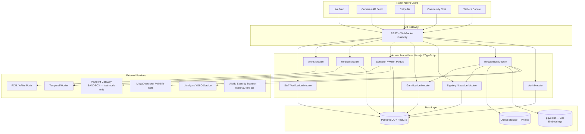
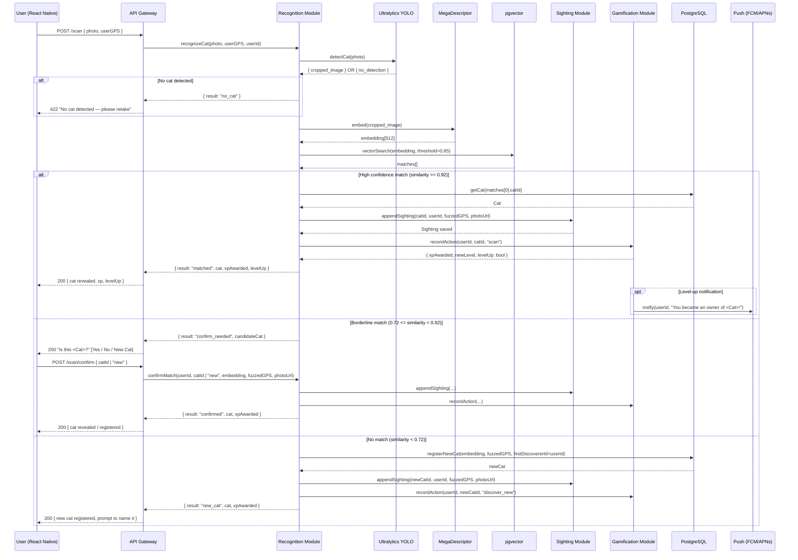
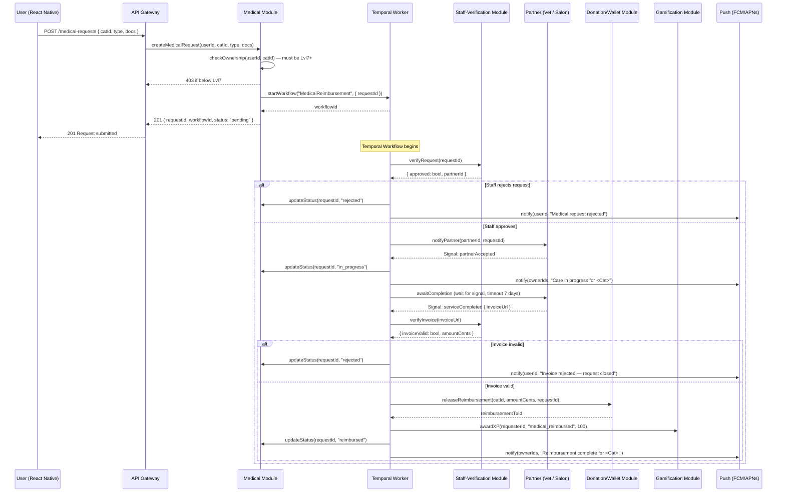
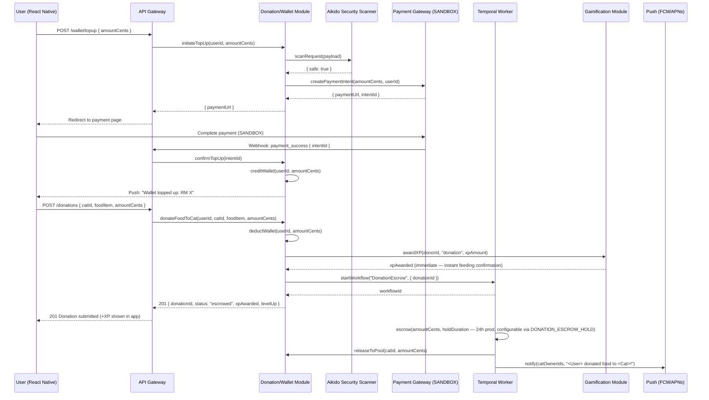

# Design Document: SnapCat

## Overview

SnapCat is a community-driven stray cat care app for Malaysia, styled after Pokémon GO. A live geo-map is the hub: undiscovered cats appear as silhouettes at their last-known approximate location (geo-fuzzed ±100–200 m). Users travel to a cat, scan it with their camera, and the AI pipeline (YOLO detection + MegaDescriptor re-ID) either reveals an existing cat or registers a new one. Discovering, funding, and caring for cats forms a contribution ladder that unlocks community chat, medical/grooming requests, and in-app cosmetics.

The backend is a **modular monolith**: a single deployable with clearly separated modules — Auth, Recognition, Sighting/Location, Gamification, Donation/Wallet, Medical, Alerts, and Staff-Verification — connected by internal service interfaces, not network calls. Durable workflows (Temporal) handle multi-step operations such as medical reimbursement and donation escrow.

---

## Architecture



---

## Data Models

### User

```typescript
interface User {
  id: UUID;
  email: string;
  displayName: string;
  xp: number;
  walletBalance: number; // in MYR cents (sandbox)
  createdAt: Date;
}
```

### Cat

```typescript
interface Cat {
  id: UUID;
  name: string | null;
  embeddingRef: string; // reference to vector store entry
  firstDiscovererId: UUID;
  lastKnownApproxLat: number;
  lastKnownApproxLng: number;
  photoUrl: string | null;
  registeredAt: Date;
}
```

### UserCatDiscovery _(per-user "found" state — distinct from ownership)_

```typescript
interface UserCatDiscovery {
  userId: UUID;
  catId: UUID;
  discoveredAt: Date;
}
```

### Ownership _(contribution ladder — distinct from discovery)_

```typescript
interface Ownership {
  userId: UUID;
  catId: UUID;
  level: number; // 0 = Discovered, 1+ = Owner
  xp: number; // XP contributed specifically for this cat
  since: Date;
}
```

### Sighting

```typescript
interface Sighting {
  id: UUID;
  catId: UUID;
  reporterId: UUID;
  timestamp: Date;
  fuzzedLat: number; // ±100–200 m from actual GPS
  fuzzedLng: number;
  photoUrl: string;
  type: "scan" | "manual";
}
```

### Donation

```typescript
interface Donation {
  id: UUID;
  donorId: UUID;
  catId: UUID;
  foodItem: string;
  amountCents: number;
  source: "wallet" | "direct";
  workflowId: string; // Temporal workflow ID
  status: "pending" | "escrowed" | "released" | "refunded";
  createdAt: Date;
}
```

### MedicalRequest

```typescript
interface MedicalRequest {
  id: UUID;
  catId: UUID;
  requesterId: UUID;
  type: "medical" | "grooming";
  status:
    | "pending"
    | "verified"
    | "in_progress"
    | "reimbursed"
    | "rejected"
    | "timed_out";
  partnerId: UUID | null;
  workflowId: string; // Temporal workflow ID
  documents: string[]; // object-storage URLs
  createdAt: Date;
}
```

### ChatMessage

```typescript
interface ChatMessage {
  id: UUID;
  catId: UUID;
  senderId: UUID;
  content: string;
  createdAt: Date;
}
```

### Partner

```typescript
interface Partner {
  id: UUID;
  name: string;
  type: "vet" | "salon";
  contactEmail: string;
  verified: boolean;
}
```

---

## Module Breakdown

### Auth Module

- JWT-based authentication (register, login, refresh, logout)
- Permissions middleware: ownership level checks for gated resources

### Recognition Module

- Orchestrates the two-stage AI pipeline (see Sequence Diagram 1)
- Calls YOLO service → crops cat from photo
- Calls MegaDescriptor → generates 512-dim embedding → queries pgvector
- Decides: reveal existing / ask user / register new
- Triggers Sighting creation and Gamification XP events after a match

### Sighting / Location Module

- Stores sightings with PostGIS geo-index
- Fuzzes GPS coordinates before persistence
- Provides map tile query: returns pins/silhouettes filtered by user's UserCatDiscovery set
- Updates `Cat.lastKnownApproxLocation` on every new sighting

### Gamification Module

- Awards XP per action: discover new cat (100 XP, global + per-cat), re-sight scan (3 XP, once per unique daily scan per cat), donation (1 XP per MYR, capped at 200 XP/day per cat), medical reimbursement (100 XP)
- Checks Ownership XP thresholds (Lvl1 = 1 XP cumulative per-cat) → promotes Discovered → Owner (level 1)
- Broadcasts level-up notifications via Alerts Module

### Donation / Wallet Module

- Top-up wallet via Payment Gateway SANDBOX
- Donate food: deducts wallet → creates Donation record → Temporal escrow workflow
- Aikido security scanner wraps all payment surface calls

### Medical Module

- Creates MedicalRequest → starts Temporal medical-reimbursement workflow
- Gated: requester must be Lvl7+ Owner of the cat (Requirements 8.3, 17.7 — loyalty threshold; shown greyed out with "Available after Level 7" below Lvl7)
- Attaches supporting documents to object storage

### Alerts Module

- Sends push notifications (FCM/APNs) for: level-up, medical status updates, new sightings near user, donation release
- Rate-limited to prevent spam

### Staff-Verification Module

- Internal admin API for verifying Partner records
- Approves/rejects pending partner applications

---

## Components and Interfaces

### Auth Module

**Purpose**: Handles user registration, login, token lifecycle, and permission enforcement.

**Interface**:

```typescript
interface AuthModule {
  register(email: string, password: string, displayName: string): Promise<User>;
  login(
    email: string,
    password: string,
  ): Promise<{ accessToken: string; refreshToken: string }>;
  refreshToken(refreshToken: string): Promise<{ accessToken: string }>;
  logout(refreshToken: string): Promise<void>;
  checkOwnership(userId: UUID, catId: UUID, minLevel: number): Promise<boolean>;
}
```

**Responsibilities**:

- Issue and validate JWT access tokens (15-minute expiry, enforced exactly with no tolerance)
- Rotate refresh tokens on use
- Expose middleware for ownership-level gating on all protected routes

---

### Recognition Module

**Purpose**: Orchestrates the two-stage AI pipeline (YOLO detection + MegaDescriptor re-ID) to match or register cats.

**Interface**:

```typescript
interface RecognitionModule {
  recognizeCat(
    photo: Buffer,
    userGPS: LatLng,
    userId: UUID,
  ): Promise<RecognitionResult>;
  confirmMatch(
    userId: UUID,
    catId: UUID | "new",
    embedding: number[],
    fuzzedGPS: LatLng,
    photoUrl: string,
  ): Promise<RecognitionResult>;
}

type RecognitionResult =
  | { result: "no_cat" }
  | { result: "matched"; cat: Cat; xpAwarded: number; levelUp: boolean }
  | { result: "confirm_needed"; candidateCat: Cat }
  | { result: "new_cat"; cat: Cat; xpAwarded: number };
```

**Responsibilities**:

- Call YOLO service to crop cat from photo
- Call MegaDescriptor to produce 512-dim embedding
- Query pgvector with similarity thresholds (≥0.92 = matched, 0.72–0.92 = confirm, <0.72 = new)
- Trigger Sighting creation and Gamification XP events after a confirmed match

---

### Sighting / Location Module

**Purpose**: Persists cat sightings with fuzzed GPS and serves geo-filtered map data.

**Interface**:

```typescript
interface SightingModule {
  appendSighting(
    catId: UUID,
    reporterId: UUID,
    rawGPS: LatLng,
    photoUrl: string,
    type: "scan" | "manual",
  ): Promise<Sighting>;
  getMapPins(viewBounds: BoundingBox, userId: UUID): Promise<MapPin[]>;
  updateCatLastKnownLocation(catId: UUID, fuzzedGPS: LatLng): Promise<void>;
}

interface MapPin {
  catId: UUID;
  approxLat: number;
  approxLng: number;
  discovered: boolean; // true if UserCatDiscovery record exists for this user
}
```

**Responsibilities**:

- Apply ±100–200 m GPS jitter before persisting or serving any coordinate
- Index sightings with PostGIS for efficient bounding-box queries
- Return silhouette pins for undiscovered cats, full pins for discovered cats

---

### Gamification Module

**Purpose**: Awards XP for user actions and manages per-user, per-cat ownership level progression.

**Interface**:

```typescript
interface GamificationModule {
  recordAction(
    userId: UUID,
    catId: UUID,
    action: GamificationAction,
  ): Promise<XPResult>;
  getOwnership(userId: UUID, catId: UUID): Promise<Ownership | null>;
}

type GamificationAction =
  | "discover_new"
  | "scan"
  | "donation"
  | "medical_reimbursed";

interface XPResult {
  xpAwarded: number;
  newLevel: number;
  levelUp: boolean;
}
```

**Responsibilities**:

- Award XP per the Gamification Rules table
- Enforce the 200 XP/day donation cap per user per cat
- Promote Ownership level when cumulative per-cat XP crosses a threshold
- Trigger Alerts Module on level-up

---

### Donation / Wallet Module

**Purpose**: Manages wallet top-ups via sandbox payment gateway and food donation escrow workflows.

**Interface**:

```typescript
interface DonationModule {
  initiateTopUp(
    userId: UUID,
    amountCents: number,
  ): Promise<{ paymentUrl: string; intentId: string }>;
  confirmTopUp(intentId: string): Promise<void>;
  donateFoodToCat(
    userId: UUID,
    catId: UUID,
    foodItem: string,
    amountCents: number,
  ): Promise<Donation>;
  releaseToPool(catId: UUID, amountCents: number): Promise<void>;
  releaseReimbursement(
    catId: UUID,
    amountCents: number,
    requestId: UUID,
  ): Promise<string>;
}
```

**Responsibilities**:

- Enforce wallet balance non-negativity before any debit
- Reject donations when user has insufficient inventory; no donation record shall be created for rejected transactions
- Wrap all payment surface calls with Aikido security scanner (if available) or `npm audit` + Trivy
- Start `DonationEscrow` Temporal workflow on food donation
- Handle payment gateway webhooks idempotently

---

### Medical Module

**Purpose**: Creates and tracks medical/grooming requests for cats, driven by a Temporal reimbursement workflow.

**Interface**:

```typescript
interface MedicalModule {
  createMedicalRequest(
    userId: UUID,
    catId: UUID,
    type: "medical" | "grooming",
    docs: string[],
  ): Promise<MedicalRequest>;
  updateStatus(
    requestId: UUID,
    status: MedicalRequest["status"],
  ): Promise<void>;
  getRequest(requestId: UUID): Promise<MedicalRequest>;
}
```

**Responsibilities**:

- Gate request creation behind Lvl1+ ownership check
- Upload supporting documents to private object storage
- Start `MedicalReimbursement` Temporal workflow (workflow ID = requestId for idempotence)

---

### Alerts Module

**Purpose**: Delivers push notifications (FCM/APNs) for key lifecycle events.

**Interface**:

```typescript
interface AlertsModule {
  notify(
    userId: UUID,
    message: string,
    payload?: Record<string, unknown>,
  ): Promise<void>;
  notifyMany(
    userIds: UUID[],
    message: string,
    payload?: Record<string, unknown>,
  ): Promise<void>;
}
```

**Responsibilities**:

- Rate-limit notifications to ≤10 per user per sliding 1-hour window (ownership milestone notifications bypass this limit)
- Route to FCM (Android) or APNs (iOS) based on device registration
- Triggered by: level-up, medical status change, new nearby sighting, donation release

---

### Staff-Verification Module

**Purpose**: Internal admin API for approving partner (vet/salon) applications and verifying medical invoices.

**Interface**:

```typescript
interface StaffVerificationModule {
  verifyRequest(
    requestId: UUID,
  ): Promise<{ approved: boolean; partnerId: UUID | null }>;
  verifyInvoice(
    invoiceUrl: string,
  ): Promise<{ invoiceValid: boolean; amountCents: number }>;
  approvePartner(partnerId: UUID): Promise<void>;
  rejectPartner(partnerId: UUID, reason: string): Promise<void>;
}
```

**Responsibilities**:

- Restricted to staff-role JWT holders only
- Signals Temporal workflows via verified/rejected outcomes
- Maintains Partner registry with verification status

---

## Sequence Diagrams

### Diagram 1: Scan → Recognition Flow (YOLO + MegaDescriptor)



---

### Diagram 2: Temporal Medical-Reimbursement Workflow



---

### Diagram 3: Donation / Wallet Top-Up & Food Donation Flow



---

## Cat Profile Screen

The **Cat Profile** is the convergence screen in the user flow — all paths (map tap on revealed pin, scan result, Catpedia entry tap) route here.

**Contents:**

- Cat name, photo, sighting history, last-known area
- Ownership level + XP progress bar for the current user
- "Feed Cat" button (WebAR) — available to Lvl0+ (discovered)
- Owner Leaderboard — ranked list of all users who have contributed to this cat, sorted by per-cat XP
- "Community Chat" — gated to Lvl1+ Owners
- "Request Medical / Grooming" — gated to Lvl7+ Owners; below Lvl7 shown greyed out with "Available after Level 7"

### Owner Leaderboard

The Cat Profile displays a per-cat leaderboard showing all Owners (Lvl1+) ranked by cumulative per-cat XP. The leaderboard:

- Shows user display name, ownership level, and XP total
- Is visible to anyone who has discovered the cat (Lvl0+)
- Displays a "No owners yet" message when no Lvl1+ Owners exist
- Updates in near-real-time as donations and actions accrue XP
- Highlights the current user's position

**Interface:**

```typescript
interface LeaderboardEntry {
  userId: UUID;
  displayName: string;
  level: number;
  xp: number;
  rank: number;
}

interface CatProfileModule {
  getLeaderboard(catId: UUID, limit?: number): Promise<LeaderboardEntry[]>;
}
```

**API Endpoint:** `GET /cats/:catId/leaderboard?limit=20`

---

## AR Feeding (WebAR via WebView)

The "AR Feeding" feature is delivered as a browser-based WebAR experience (AR.js / WebXR — fully open-source) loaded inside a React Native WebView:

1. User taps "Feed Cat" on a revealed cat's profile.
2. App opens a WebView pointing to the in-app WebAR page.
3. WebAR page (AR.js / WebXR) activates device camera, overlays an animated food bowl or kibble.
4. On interaction complete, WebView posts a `feedingComplete` message to React Native.
5. React Native sends `POST /donations` to trigger the donation workflow.

This keeps AR entirely browser-based — no native AR SDK or paid service (like 8th Wall) required.

---

## Gamification Rules

| Action                        | XP Awarded | Notes                            |
| ----------------------------- | ---------- | -------------------------------- |
| First scan (discover new cat) | 100 XP     | Bonus for being first discoverer |
| Scan existing cat             | 3 XP       | Per unique daily scan per cat    |
| Donate food item (1 RM)       | 1 XP       | e.g., kibble = 1 RM = 1 XP       |
| Donate food item (5 RM)       | 5 XP       | e.g., cat snack = 5 RM = 5 XP    |
| Donate food item (10 RM)      | 10 XP      | e.g., tuna can = 10 RM = 10 XP   |
| Submit medical request        | 100 XP     | On reimbursement completion      |

**XP equals the MYR price of the donated item (1 RM = 1 XP). Capped at 200 XP/day per cat from donations.**

**Ownership Level Thresholds (cumulative per-cat XP):**

Each level's increment grows by 5 XP (Lvl1 = +1, Lvl2 = +5, Lvl3 = +10, … Lvl10 = +45), per Requirement 6.6.

| Level | Cumulative XP | Status                                 |
| ----- | ------------- | -------------------------------------- |
| Lvl0  | 0             | Discovered                             |
| Lvl1  | 1             | Owner (unlocks chat + notifications)   |
| Lvl2  | 6             |                                        |
| Lvl3  | 16            |                                        |
| Lvl4  | 31            |                                        |
| Lvl5  | 51            |                                        |
| Lvl6  | 76            |                                        |
| Lvl7  | 106           | Unlocks medical/grooming requests      |
| Lvl8  | 141           |                                        |
| Lvl9  | 181           |                                        |
| Lvl10 | 226           | Max level                              |

XP counters never reset on level-up; accumulated XP remains visible to the User at all times. Levels can decrease if XP falls below a threshold.

---

## Error Handling

### Error Scenario 1: No Cat Detected in Photo

**Condition**: YOLO service finds no cat in the submitted photo.
**Response**: Recognition Module returns `{ result: "no_cat" }`; API Gateway responds with HTTP 422 and message "No cat detected — please retake".
**Recovery**: User retakes the photo. No sighting or XP record is created.

---

### Error Scenario 2: Insufficient Wallet Balance

**Condition**: User attempts a food donation where `amountCents` exceeds their current `walletBalance`.
**Response**: Donation Module rejects the request before any debit occurs; API Gateway responds with HTTP 400 and message "Insufficient wallet balance".
**Recovery**: User is directed to top up their wallet. No Temporal workflow is started and no balance is modified.

---

### Error Scenario 3: Ownership Gate Failure (Chat / Medical)

**Condition**: A user below the required ownership level attempts to submit a ChatMessage (requires Lvl1+) or a MedicalRequest (requires Lvl7+) for a cat.
**Response**: Auth middleware or Medical Module returns HTTP 403 "Insufficient ownership level" with the required and current levels.
**Recovery**: No message or request is persisted. User is shown the ownership requirements and their current XP towards the required level.

---

### Error Scenario 4: Temporal Workflow Re-trigger (Duplicate workflowId)

**Condition**: A MedicalRequest or Donation workflow is re-submitted with a workflowId that already exists in Temporal (e.g., due to a network retry).
**Response**: Temporal deduplicates on workflowId and returns the existing workflow's state. No second financial operation is executed.
**Recovery**: The calling module reads the existing workflow status and returns it to the client as if the original request succeeded. This enforces Property 6 (idempotence).

---

### Error Scenario 5: Partner Timeout (Medical Workflow)

**Condition**: A verified partner does not signal `serviceCompleted` within the 7-day Temporal timeout window.
**Response**: Temporal's timer fires; the workflow transitions the MedicalRequest to `rejected` status and notifies the requester via push notification.
**Recovery**: User may submit a new MedicalRequest. Escrowed funds are not released.

---

### Error Scenario 6: AI Service Unavailable (YOLO / MegaDescriptor)

**Condition**: The YOLO or MegaDescriptor external service returns an error or times out during a scan.
**Response**: Recognition Module propagates an HTTP 503 "AI service temporarily unavailable — please try again shortly".
**Recovery**: No partial sighting or embedding is written. The client may retry the scan. Temporal is not involved in this flow.

---

### Error Scenario 7: Payment Webhook Failure

**Condition**: The payment gateway webhook for a top-up event is delayed, duplicated, or arrives out of order.
**Response**: `confirmTopUp` is idempotent on `intentId`; duplicate webhooks are detected and ignored. Delayed webhooks are processed normally when received.
**Recovery**: Wallet is credited exactly once per successful payment intent. Aikido scanner validates the webhook payload before any balance mutation.

---

## Testing Strategy

### Unit Testing Approach

Each module is tested in isolation with its external dependencies (database, AI services, Temporal, payment gateway, push provider) replaced by fakes or mocks.

Key unit test cases:

- **Recognition Module**: Correct result variant (`matched` / `confirm_needed` / `new_cat` / `no_cat`) for similarity values at and around the 0.72 and 0.92 thresholds.
- **Gamification Module**: XP award amounts match the Gamification Rules table for each action; daily 200 XP donation cap is enforced; ownership level promotion fires at the correct cumulative XP thresholds.
- **Donation Module**: Wallet debit is rejected when balance would go negative; `confirmTopUp` is idempotent on the same `intentId`.
- **Sighting Module**: Fuzzed coordinates always differ from raw input (GPS_Fuzz invariant); PostGIS bounding-box queries return the correct pins per user discovery state.
- **Auth Module**: Expired access tokens are rejected; refresh token rotation invalidates the previous token.

---

### Property-Based Testing Approach

**Property Test Library**: fast-check (TypeScript)

Properties derived from the Correctness Properties section are verified with randomly generated inputs:

| Property                          | Generator Strategy                                                                                                                             |
| --------------------------------- | ---------------------------------------------------------------------------------------------------------------------------------------------- |
| **P1 — Scan result exclusivity**  | Generate random similarity scores (0.0–1.0) and assert exactly one `RecognitionResult` variant is returned.                                    |
| **P2 — GPS fuzz invariant**       | Generate raw GPS coordinates (lat ∈ [–90, 90], lng ∈ [–180, 180]); assert fuzzed output differs from raw input by a non-zero offset.           |
| **P3 — Ownership monotonicity**   | Generate sequences of XP-award events; assert level never decreases once Lvl1 is reached during normal operation.                              |
| **P4 — Wallet non-negativity**    | Generate interleaved top-up and donation sequences; assert balance never goes below 0 after any committed transaction.                         |
| **P6 — Temporal idempotence**     | Re-trigger workflows with duplicate workflowIds; assert final financial outcome (credits/debits/reimbursements) equals the single-run outcome. |
| **P10 — XP award correctness**    | Generate random donation amounts; assert XP = price in MYR, capped at 200/day per user per cat.                                                |
| **P11 — Notification rate limit** | Generate bursts of notification triggers; assert ≤10 notifications delivered per user per 1-hour sliding window.                               |

---

### Integration Testing Approach

Integration tests run against a local environment with real PostgreSQL/PostGIS, pgvector, and a Temporal dev server, but with AI services and the payment gateway replaced by deterministic stubs.

Key integration test scenarios:

- **Full scan flow** (Diagram 1): Submit a photo stub, traverse all three recognition branches, assert Sighting and Ownership records are written correctly and XP is awarded.
- **Medical reimbursement workflow** (Diagram 2): Walk the full Temporal workflow through staff approval, partner acceptance, invoice verification, and reimbursement release; assert status transitions and XP award.
- **Donation escrow workflow** (Diagram 3): Top up wallet, donate, assert donor XP is awarded immediately in the donation response, then assert escrow hold and funds release; assert wallet balance updates atomically.
- **Geo-map visibility**: Insert cats with and without UserCatDiscovery records; assert the map pin response omits name/photo/exact location for undiscovered cats.
- **Ownership gate enforcement**: Attempt ChatMessage submission as Lvl0 user; assert HTTP 403; promote to Lvl1; assert HTTP 201. Attempt MedicalRequest submission as Lvl1–Lvl6 user; assert HTTP 403; promote to Lvl7; assert HTTP 201.

---

## Security Considerations

- **Aikido** security scanner (optional — used only if free tier is available; otherwise replaced by `npm audit` + Trivy for dependency/vulnerability scanning) wraps all payment and donation API surface calls to detect injection, SSRF, and dependency vulnerabilities.
- GPS coordinates stored raw in the backend; only **fuzzed coordinates** (±100–200 m jitter) are served to clients.
- Medical documents are stored in private object storage with signed URL access.
- JWT tokens expire in 15 minutes (enforced exactly with no tolerance); refresh tokens rotate on use.
- All Temporal workflows are idempotent (workflow ID = requestId) to prevent double-charges.

---

## Correctness Properties

_A property is a characteristic or behavior that should hold true across all valid executions of a system — essentially, a formal statement about what the system should do. Properties serve as the bridge between human-readable specifications and machine-verifiable correctness guarantees._

### Property 1: Scan result exclusivity

_For any_ scan submission, the Recognition Module SHALL return exactly one of: `no_cat`, `matched`, `confirm_needed`, or `new_cat` — never more than one, never zero on a completed request.

**Validates: Requirements 3.1, 3.2, 3.3, 4.3, 4.4, 4.5**

### Property 2: GPS fuzz invariant

_For any_ Sighting record written to the database and for any coordinate value returned to a client, the served latitude/longitude SHALL differ from the original raw GPS input by a non-zero offset (GPS_Fuzz applied, never the exact raw value).

**Validates: Requirements 5.3, 5.5, 14.2**

### Property 3: Ownership promotion monotonicity

_For any_ user–cat pair, once the Ownership level reaches Lvl1 (≥ 500 XP), subsequent XP accumulation SHALL never cause the level to decrease below 1 during normal operation.

**Validates: Requirements 6.5, 6.7**

### Property 4: Wallet balance non-negativity

_For any_ sequence of donation or top-up operations on a User account, the walletBalance after each committed transaction SHALL be ≥ 0. A donation whose amount exceeds the current walletBalance SHALL be rejected without modifying the balance.

**Validates: Requirements 10.2, 10.3, 10.4, 10.7**

### Property 5: Discovery–Ownership referential integrity

_For any_ Ownership record in the database, a corresponding UserCatDiscovery record with the same (userId, catId) pair SHALL also exist. Promoting a user to Lvl1 SHALL NOT delete or modify the UserCatDiscovery record.

**Validates: Requirements 6.7, 14.3**

### Property 6: Temporal workflow idempotence

_For any_ MedicalRequest or Donation Temporal workflow re-triggered with an already-used workflowId, the final financial outcome (amount credited, amount debited, reimbursement released) SHALL be identical to the outcome of the original single run — no double charge and no double reimbursement.

**Validates: Requirements 10.5, 14.4**

### Property 7: Ownership gates chat and medical access

_For any_ ChatMessage submission or MedicalRequest submission, the System SHALL accept the request if and only if the submitting User has an Ownership record with level ≥ 1 for the associated Cat. All submissions by non-Owners SHALL be rejected with a 403 error.

**Validates: Requirements 8.1, 8.2, 9.1, 9.2**

### Property 8: Embedding dimensionality consistency

_For any_ cat image crop passed through MegaDescriptor, the returned embedding vector SHALL have exactly 512 dimensions, and embedding the same crop twice SHALL produce vectors with cosine similarity ≥ 0.99 (deterministic inference).

**Validates: Requirements 4.1**

### Property 9: Discovery state controls map and Catpedia visibility

_For any_ User–Cat pair where a UserCatDiscovery record does NOT exist, every client response about that Cat (map pin data, Catpedia entry data, tap detail data) SHALL omit the Cat's name, photo, and exact location and SHALL only expose the approximate area. Where a UserCatDiscovery record DOES exist, the full Cat profile data SHALL be available.

**Validates: Requirements 2.2, 2.3, 2.4, 7.3, 7.4, 7.5**

### Property 10: XP award correctness

_For any_ scan action that discovers a new Cat, exactly 100 XP is awarded to the discoverer for that Cat. For any re-sighting scan (first scan of that cat by that user on a given calendar day), exactly 50 XP is awarded. For any food item donation where the item costs P MYR, the XP awarded = P (capped so daily donation XP per user per cat does not exceed 200). For any completed medical reimbursement, exactly 100 XP is awarded to the requester for that Cat.

**Validates: Requirements 6.1, 6.2, 6.3, 6.4**

### Property 11: Notification rate limit

_For any_ User and any sliding 1-hour window, the total number of push notifications delivered to that User SHALL NOT exceed 10, EXCEPT for ownership milestone notifications which SHALL bypass the rate limit.

**Validates: Requirements 12.5**
