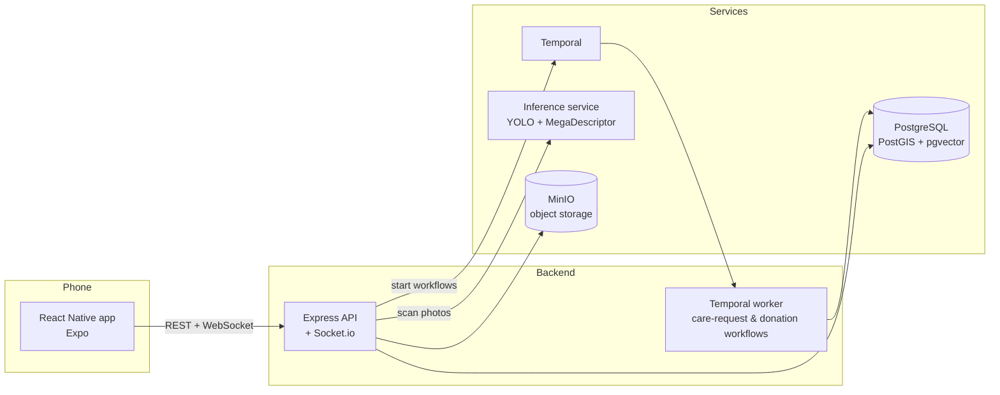

# SnapCat 🐾

**A [Hack The Kitty](https://hackthekitty.com/) hackathon project.**

SnapCat is a community-driven stray cat care platform for Malaysia. Stray cats appear as silhouettes on a live map — walk up, scan one with your camera, and a two-stage AI pipeline (YOLO detection + MegaDescriptor re-identification) either recognises a known cat or registers a new one. Caring for cats builds a per-cat contribution ladder that unlocks community features as you level up.

> **Naming note:** the app and all user-facing branding are **SnapCat**; internal identifiers (npm packages `@codingkitty/*`, Docker container names, the Expo slug) keep the original `codingkitty` working title to avoid breaking the workspace — they never appear on screen.

## Demo

<!-- TODO: add a 2–3 min demo video link here -->
📺 **Demo video:** _coming soon_

| Live map | Scan a cat | Cat profile |
| --- | --- | --- |
| <!-- screenshot --> | <!-- screenshot --> | <!-- screenshot --> |

| Community chat | Care request | Badges & rewards |
| --- | --- | --- |
| <!-- screenshot --> | <!-- screenshot --> | <!-- screenshot --> |

<!-- Drop screenshots into docs/screenshots/ and reference them like:
      -->

## Features

- **Live map** — nearby cats shown at GPS-fuzzed (±100–200 m) locations to protect them from harm; undiscovered cats appear as silhouettes
- **AI cat scanning** — YOLO cat detection + MegaDescriptor 768-dim embeddings with pgvector similarity search to re-identify individual cats
- **Catpedia** — a collectible catalogue of every cat you've discovered
- **Contribution ladder & gamification** — per-cat XP from scans and donations; levels 1–10 with badges (bronze/silver/gold/diamond), level rewards, and a leaderboard
- **Community chat** — real-time per-cat chat (Socket.io) with photo sharing, unlocked at Level 1 ownership
- **Food donations** — direct checkout shop; donations feed a community pool and award XP
- **WebAR feeding** — feed a cat in augmented reality from donated inventory
- **Medical & grooming care requests** — Level 7+ owners can request care; a durable Temporal workflow drives the full lifecycle (staff review → owner picks a certified partner clinic/salon → service window → two-sided completion proof → reimbursement from the community pool)
- **Security hardening** — GPS response guard middleware, JWT auth with rotating refresh tokens, continuous dependency/SAST scanning (Aikido), property-based tests with fast-check

## Architecture



Monorepo with three packages:

| Package           | Description                                                              |
| ----------------- | ------------------------------------------------------------------------ |
| `packages/shared` | TypeScript types and interfaces shared across client and server          |
| `packages/server` | Node.js + Express API with Prisma ORM, Temporal workflows, and Socket.io |
| `packages/client` | React Native mobile app with maps, AR feeding, and real-time chat        |

## Tech Stack

- **Language:** TypeScript
- **Server:** Express, Prisma (PostgreSQL + PostGIS + pgvector), Temporal, Socket.io
- **Client:** React Native (Expo), react-native-maps
- **Testing:** Jest + fast-check (property-based testing)
- **AI/ML:** YOLOX (cat detection), MegaDescriptor (re-identification), pgvector (embedding search)

## Getting Started

### Quick start (macOS / Linux / Windows with Git Bash)

```bash
./setup.sh
```

One command does everything: stops any previous run, checks prerequisites, installs dependencies, starts Docker services, applies migrations, seeds base data, and launches the API server, Temporal worker, and the mobile app. It prints the `exp://` URL to open in Expo Go when done. Stop everything with `./stop.sh`.

Both scripts are fully Windows/Git Bash compatible: LAN-IP detection and process cleanup fall back to PowerShell there (Git Bash ships neither `hostname -I` nor `pkill`). Re-running `./setup.sh` is always safe — it cleans up the previous run first, which also prevents the Windows Prisma file-lock error (see Troubleshooting).

On Windows without Git Bash, follow the manual steps below instead.

### Prerequisites

- Node.js 20+
- Docker (for Postgres/PostGIS/pgvector, Temporal, and MinIO)
- The [Expo Go](https://expo.dev/go) app on your phone, on the **same Wi-Fi network** as your computer

### 1. Install & configure

```bash
npm install
cp packages/server/.env.example packages/server/.env
```

### 2. Start backing services and set up the database

```bash
docker compose up -d

cd packages/server
npx prisma migrate deploy   # applies all migrations to the fresh DB
npm run prisma:seed         # base data: food items + certified partners
```

### 3. Run the app

In three separate terminals, from the repo root:

```bash
# Terminal 1 — API server
npm run dev

# Terminal 2 — Temporal worker (required for the care-request workflow)
npm run worker --workspace @codingkitty/server

# Terminal 3 — Mobile app, pointed at your computer's LAN IP so a physical
# phone on the same Wi-Fi can reach the API (find your IP with `ipconfig`
# on Windows or `ifconfig`/`ip a` on Mac/Linux)
cd packages/client
EXPO_PUBLIC_API_URL=http://<YOUR-LAN-IP>:3000 npx expo start
```

Scan the QR code Expo prints with the Expo Go app. If your phone can't reach your computer's LAN IP (e.g. campus Wi-Fi that isolates devices, or judging over separate networks), use one of the tunnel scripts in `packages/client` (`start-tunnel.sh` / `start-tunnel.ps1`) instead — they require [`cloudflared`](https://github.com/cloudflare/cloudflared/releases) installed and generate a public URL that works over the internet.

### 4. Populate demo data (optional)

Register an account in the app first, then see **[docs/DEMO-GUIDE.md](docs/DEMO-GUIDE.md)** to seed a full showcase dataset (cats at every level, care requests at every lifecycle stage, community chat, donation history) for that account.

## Troubleshooting

Hard-won lessons from our own demo setups — check here before debugging from scratch.

### `npm install` / `prisma generate` fails with `EPERM: operation not permitted, rename '...query_engine-windows.dll.node...'`
The API server or Temporal worker is still running and holds the Prisma engine DLL (Windows locks in-use files). `./setup.sh` now stops the previous run automatically before installing, so simply re-running it usually resolves this. If installing manually, **always stop the stack first**:
```bash
./stop.sh          # or Ctrl+C every terminal running dev/worker/expo
npm install        # now succeeds
./setup.sh
```
If it persists, some orphaned `node.exe` from an old terminal is still alive — check Task Manager for node processes and end the ones whose command line mentions `ts-node-dev`, `worker`, or `expo`.

### `./setup.sh: No such file or directory`
You are one folder too high. The repo root is the **inner** `codingkitty` folder:
```bash
cd codingkittyhackaton/codingkitty/codingkitty   # note: codingkitty twice
```

### Phone shows "Failed to download remote update" (java.io.IOException)
The app in Expo Go is pointing at a **dead tunnel URL**. Every tunnel restart mints a brand-new `trycloudflare.com` URL, so:
- **Always scan the freshly printed QR code** — never tap the project under "Recently opened" in Expo Go.
- If it still fails, the tunnel may be up but Metro unreachable: on some Windows setups Metro binds only the IPv6 loopback (`::1`), which is why `start-tunnel.ps1` targets `[::1]:8082` for the Metro tunnel. Don't change that back to `127.0.0.1` (it 502s).

### Expo Go says "Project is incompatible with this version of Expo Go"
The project is pinned to **Expo SDK 54** on purpose — the Play Store build of Expo Go supports SDK 54. If you see this error, either your Expo Go auto-updated to a different SDK build, or someone bumped `expo` in `packages/client/package.json`. Keep `"expo": "~54.0.0"`, and when installing new Expo packages use `npx expo install <pkg>` so versions match the SDK.

### App bundle fails with `Unable to resolve module <something>`
An `expo install`/`npm install` in a workspace sometimes prunes hoisted packages other libraries need (we lost `buffer` this way). Fix: stop the stack, run `npm install` once at the **repo root**, restart.

### Demo seed errors with "No certified partners found" or "User not found"
Order matters: `npm run prisma:seed` (base data) → register your account in the app → `npx ts-node prisma/seed-demo.ts your-email@example.com`. The demo seed is safe to re-run; it clears and rebuilds its own data each time.

### Donation XP / care requests never progress
The **Temporal worker isn't running** — it processes donation escrow (XP lands ~30 s after donating) and every care-request stage transition. Start it: `npm run worker --workspace @codingkitty/server`.

## Project Structure

```
codingkitty/
├── packages/
│   ├── shared/          # Shared types & interfaces
│   ├── server/          # API server
│   │   ├── prisma/      # Database schema & migrations
│   │   ├── src/
│   │   │   ├── modules/ # Feature modules (auth, recognition, sighting, etc.)
│   │   │   ├── workflows/ # Temporal workflow definitions
│   │   │   ├── middleware/
│   │   │   └── config/
│   │   └── ...
│   └── client/          # React Native app
│       └── src/
│           ├── screens/
│           ├── navigation/
│           ├── services/
│           ├── hooks/
│           ├── components/
│           └── store/
├── package.json         # Workspace root
└── tsconfig.base.json   # Shared TS config
```

## Team

Built for [Hack The Kitty](https://hackthekitty.com/) by:

- [Yuriko Goto](https://github.com/gotoyuriko) — @gotoyuriko
- [Christian Jandra](https://github.com/christjandra15) — @christjandra15

## License

Source-available for Hack The Kitty judging and review.
